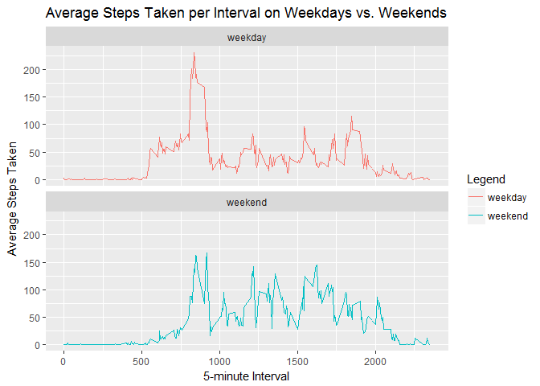

# Reproducible Research: Peer Assessment 1

Turning off scientific notation and calling a package for rounding inline text.

```r
options(scipen=999)
library(broman)
```

## Loading and preprocessing the data

1. Load the data (i.e. read.csv())

```r
setwd("~/Coursera/5 - Reproducible Research/RepData_PeerAssessment1")
filename <- unzip("activity.zip")
pers.act <- read.csv("activity.csv", header = TRUE, sep = ',')
```

2. Process/transform the data (if necessary) into a format suitable for your analysis

```r
pers.act$date <- as.Date(pers.act$date)
head(pers.act)
```

```
##   steps       date interval
## 1    NA 2012-10-01        0
## 2    NA 2012-10-01        5
## 3    NA 2012-10-01       10
## 4    NA 2012-10-01       15
## 5    NA 2012-10-01       20
## 6    NA 2012-10-01       25
```

```r
str(pers.act)
```

```
## 'data.frame':	17568 obs. of  3 variables:
##  $ steps   : int  NA NA NA NA NA NA NA NA NA NA ...
##  $ date    : Date, format: "2012-10-01" "2012-10-01" ...
##  $ interval: int  0 5 10 15 20 25 30 35 40 45 ...
```

## What is mean total number of steps taken per day?

1. Make a histogram of the total number of steps taken each day

```r
steps.day <- aggregate(steps ~ date, data = pers.act, sum, na.rm = TRUE)
head(steps.day)
```

```
##         date steps
## 1 2012-10-02   126
## 2 2012-10-03 11352
## 3 2012-10-04 12116
## 4 2012-10-05 13294
## 5 2012-10-06 15420
## 6 2012-10-07 11015
```

```r
library(ggplot2)
ggplot(steps.day, aes(x=steps)) +
       geom_histogram(binwidth=1000) +
       labs(title = "Total Steps Taken Each Day", 
            x = "Steps per Day",
            y = "Frequency")
```

<!-- -->

2. Calculate and report the mean and median total number of steps taken per day

```r
mean.steps <- mean(steps.day$steps)
mean.steps
```

```
## [1] 10766.19
```

```r
median.steps <- median(steps.day$steps)
median.steps
```

```
## [1] 10765
```
The mean total number of steps taken per day is 10766.19, whereas the median total number of steps taken per day is 10765. 

## What is the average daily activity pattern?

1. Make a time series plot (i.e. type = "l") of the 5-minute interval (x-axis) and the average number of steps taken, averaged across all days (y-axis)


```r
pers.int <- aggregate(steps ~ interval, data = pers.act, mean, na.rm = TRUE)
head(pers.int)
```

```
##   interval     steps
## 1        0 1.7169811
## 2        5 0.3396226
## 3       10 0.1320755
## 4       15 0.1509434
## 5       20 0.0754717
## 6       25 2.0943396
```

```r
ggplot(pers.int, aes(x=interval, y=steps)) +
       geom_line(color="black") +
       labs(title = "Average Steps Taken per 5-minute Interval", 
            x = "5-minute Interval",
            y = "Average Steps Taken")
```

<!-- -->

2. Which 5-minute interval, on average across all the days in the dataset, contains the maximum number of steps?

```r
max.int <- pers.int$interval[which.max(pers.int$steps)]
max.int
```

```
## [1] 835
```

On average, the 835th interval contains the maximum number of steps.

## Imputing missing values

1. Calculate and report the total number of missing values in the dataset (i.e. the total number of rows with NAs)


```r
miss.row <- sum(is.na(pers.act))
miss.row
```

```
## [1] 2304
```

There are 2304 rows with NAs in the dataset.

2. Devise a strategy for filling in all of the missing values in the dataset. The strategy does not need to be sophisticated. For example, you could use the mean/median for that day, or the mean for that 5-minute interval, etc.

I will impute missing values for steps with the mean number of steps with the average number of steps for a given 5-minute interval.

3. Create a new dataset that is equal to the original dataset but with the missing data filled in.


```r
pers.act.imp <- pers.act
pers.act.imp.na <- is.na(pers.act.imp$steps)
imp.values <- tapply(pers.act.imp$steps, pers.act.imp$interval, mean, na.rm=TRUE, simplyfy=TRUE)
pers.act.imp$steps[pers.act.imp.na] <- 
    imp.values[as.character(pers.act.imp$interval[pers.act.imp.na])]
```

4. Make a histogram of the total number of steps taken each day and Calculate and report the mean and median total number of steps taken per day. Do these values differ from the estimates from the first part of the assignment? What is the impact of imputing missing data on the estimates of the total daily number of steps?


```r
steps.day.imp <- aggregate(steps ~ date, data = pers.act.imp, sum, na.rm=TRUE)
head(steps.day.imp)
```

```
##         date    steps
## 1 2012-10-01 10766.19
## 2 2012-10-02   126.00
## 3 2012-10-03 11352.00
## 4 2012-10-04 12116.00
## 5 2012-10-05 13294.00
## 6 2012-10-06 15420.00
```

```r
ggplot(steps.day.imp, aes(x=steps)) +
       geom_histogram(binwidth=1000) +
       labs(title = "Total Steps Taken Each Day with Missing Values Imputed", 
            x = "Steps per Day",
            y = "Frequency")
```

<!-- -->

```r
mean.steps.imp <- mean(steps.day.imp$steps)
mean.steps.imp
```

```
## [1] 10766.19
```

```r
median.steps.imp <- median(steps.day.imp$steps)
median.steps.imp
```

```
## [1] 10766.19
```

Imputing missing values with the average number of steps for a given 5-minute interval changes the median, such that the mean and median are now equal to the same value, 10766.19.

## Are there differences in activity patterns between weekdays and weekends?

1. Create a new factor variable in the dataset with two levels -- "weekday" and "weekend" indicating whether a given date is a weekday or weekend day.


```r
pers.act.imp$dow <- weekdays(pers.act.imp$date)
pers.act.imp$dow <- ifelse(pers.act.imp$dow == "Saturday" | 
                           pers.act.imp$dow == "Sunday", "weekend", "weekday")
head(pers.act.imp)
```

```
##       steps       date interval     dow
## 1 1.7169811 2012-10-01        0 weekday
## 2 0.3396226 2012-10-01        5 weekday
## 3 0.1320755 2012-10-01       10 weekday
## 4 0.1509434 2012-10-01       15 weekday
## 5 0.0754717 2012-10-01       20 weekday
## 6 2.0943396 2012-10-01       25 weekday
```

2. Make a panel plot containing a time series plot (i.e. type = "l") of the 5-minute interval (x-axis) and the average number of steps taken, averaged across all weekday days or weekend days (y-axis).


```r
pers.act.imp.weekday <- subset(pers.act.imp, dow == "weekday")
pers.int.weekday <- aggregate(steps ~ interval, data = pers.act.imp.weekday, mean, na.rm = TRUE)
head(pers.int.weekday)
```

```
##   interval      steps
## 1        0 2.25115304
## 2        5 0.44528302
## 3       10 0.17316562
## 4       15 0.19790356
## 5       20 0.09895178
## 6       25 1.59035639
```

```r
pers.act.imp.weekend <- subset(pers.act.imp, dow == "weekend")
pers.int.weekend <- aggregate(steps ~ interval, data = pers.act.imp.weekend, mean, na.rm = TRUE)
head(pers.int.weekend)
```

```
##   interval       steps
## 1        0 0.214622642
## 2        5 0.042452830
## 3       10 0.016509434
## 4       15 0.018867925
## 5       20 0.009433962
## 6       25 3.511792453
```

```r
ggplot(pers.int.weekday, aes(x=interval, y=steps)) +
       geom_line(aes(color="Weekdays")) +
       geom_line(data=pers.int.weekend, aes(color="Weekends")) +
       labs(title = "Average Steps Taken per Interval on Weekdays vs. Weekends", 
            x = "5-minute Interval",
            y = "Average Steps Taken",
            color = "Legend")
```

<!-- -->
